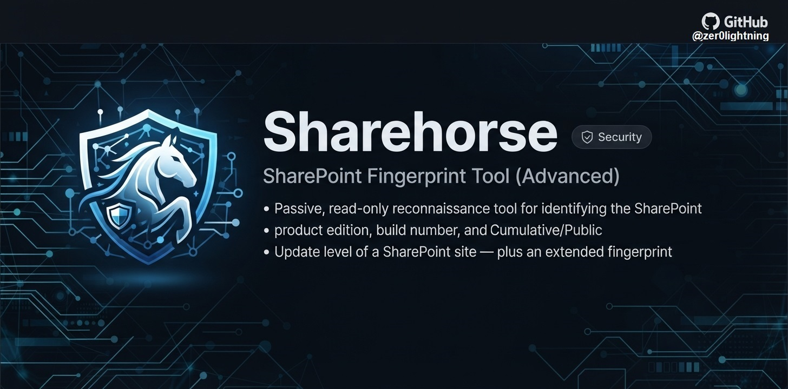

# Sharehorse - SharePoint Fingerprint Tool



A single-file, browser-console tool that passively fingerprints a SharePoint site - on-premises or online. It identifies the product edition, build number, and Cumulative/Public Update (CU/PU) from a local database of the official Microsoft build history, then gathers a wider fingerprint: site collection compatibility mode, sovereign cloud instance, topology, regional settings, and infrastructure headers.

**For authorized use only.** For security assessment, asset inventory, and education, on systems you own or are permitted to test. See the [Disclaimer](#disclaimer).

See it in action: [Screenshots and sample reports](#samples).

---

## Table of Contents

**Overview**
- [What it does](#what-it-does)
- [Why Sharehorse](#why-sharehorse)
- [Use cases](#use-cases)

**Getting started**
- [Usage](#usage)
- [Console helpers](#console-helpers)
- [Batch mode](#batch-mode)
- [Samples](#samples)

**How it works**
- [How detection works](#how-detection-works)
- [Site-relative REST API resolution](#site-relative-rest-api-resolution)
- [The `MicrosoftSharePointTeamServices` header bug](#the-microsoftsharepointteamservices-header-bug)
- [The SharePoint 2019 / Subscription Edition RTM collision](#the-sharepoint-2019--subscription-edition-rtm-collision)
- [Diagnostics](#diagnostics-timeouts-auth-redirects-and-access-errors)
- [The five extended fingerprint signals](#the-five-extended-fingerprint-signals)
  - [1. Site collection compatibility mode](#1-site-collection-compatibility-mode)
  - [2. Sovereign / national cloud instance](#2-sovereign--national-cloud-instance)
  - [3. Site collection topology](#3-site-collection-topology)
  - [4. Regional settings & installed languages](#4-regional-settings--installed-languages)
  - [5. Infrastructure signals](#5-infrastructure-signals)
- [Extended contextinfo fields](#extended-contextinfo-fields)
- [Confidence scoring](#confidence-scoring)
- [Output](#output)
- [Network cost of the extended signals](#network-cost-of-the-extended-signals)

**Signature database**
- [Build database](#build-database)
- [Automated signature updates](#automated-signature-updates)
- [Maintaining the build database](#maintaining-the-build-database)

**Scope & safety**
- [What's intentionally not implemented](#whats-intentionally-not-implemented)
- [Scope & limitations](#scope--limitations)
- [Privacy & safety](#privacy--safety)

**Defensive guidance**
- [Hardening](#hardening)
- [Detection](#detection)
- [Migration](#migration)

**About**
- [Disclaimer](#disclaimer)
- [License](#license)
- [References](#references)

---

## Overview

### What it does

SharePoint doesn't expose its version in one reliable place, and the signal most people reach for (an HTTP header) has an unfixed formatting bug since 2019. Sharehorse:

1. Collects every version signal it can reach in the current session (8-second timeout per request).
2. Cross-validates them, working around the header bug.
3. Resolves REST calls against the actual site collection, not the domain root (see [Site-relative REST API resolution](#site-relative-rest-api-resolution)).
4. Matches the build against a local database of the **full official Microsoft build history** (2013, 2016, 2019, Subscription Edition).
5. Reports product, exact CU/PU, KB, release date, and a confidence level - including the 2019/SE shared-RTM ambiguity.
6. Flags timeouts, auth redirects, and 401/403s as explicit **Diagnostics**.
7. Saves `.txt` and `.json` reports, and can scan many site collections at once (**batch mode**) into a combined CSV.

Beyond the farm build, it also surfaces: **compatibility-mode drift** (a site stuck on an older level than the farm), **GCC High vs. commercial** cloud (from the hostname, free), and **hub-site / Microsoft 365 Group** association.

No vulnerability scanning, exploitation, or writes. See [Privacy & safety](#privacy--safety).

### Why Sharehorse

The version header people trust first - `MicrosoftSharePointTeamServices` - is metabase-cached, varies across load-balanced nodes, and on 2019+/SE is malformed (reports build `0`, misclassifying the farm as 2016). Sharehorse instead reads reliable sources and maps the build to the exact CU.

This matters because on-premises SharePoint is a high-value, actively exploited target where exposure often comes down to a single CU - so the exact build is the line between "patched" and "exploitable." That serves both assessors (real patch state) and defenders (patch-compliance inventory, compat-mode drift).

Fingerprinting is dual-use, so the project also ships [hardening](./HARDENING.md), [detection](./DETECTION.md), and [migration](./MIGRATE.md) guidance. Read-only, for systems you own or may test. See the [Disclaimer](#disclaimer).

### Use cases

**Red team (authorized):**

- Pin the exact build/CU, past the header bug that misreads 2019/SE as 2016.
- Triage which farms are behind on patches.
- Passive and read-only - fingerprints, never exploits.

**Blue team:**

- Patch-compliance inventory across site collections ([batch mode](#batch-mode)).
- Spot compat-mode drift and version leakage; reduce it with [HARDENING.md](./HARDENING.md).
- Detect the same fingerprinting against you with [DETECTION.md](./DETECTION.md).

---

## Getting started

### Usage

1. Open the target SharePoint site in Chrome (or any Chromium browser).
2. DevTools (`F12`) → **Console**.
3. Paste all of `sharehorse.js` and press Enter.
4. Read the summary card, expand the collapsed groups (including **🧬 Extended Fingerprint**), and check your downloads for the `.txt`/`.json` reports.

If a download is blocked (extension or CSP), use the [console helpers](#console-helpers) to copy the data from the clipboard instead.

### Console helpers

Available after the script runs once, for the rest of the session:

| Function | Returns |
|---|---|
| `__spDetectorReport()` | Full plain-text report (same as the `.txt`) |
| `__spDetectorReportJSON()` | Full JSON report string (with an `extendedFingerprint` object) |
| `__spDetectorSummary()` | Just the summary card as text |
| `__spDetectorLastResult` | Raw detection result object (property, not a function) |
| `__spDetectorBatch(urls)` | Runs [batch mode](#batch-mode) over an array of URLs |

```js
copy(__spDetectorSummary())
```

### Batch mode

Scan multiple site collections on the **same origin**:

```js
await __spDetectorBatch([
  "https://tenant.sharepoint.com/sites/TeamA",
  "https://tenant.sharepoint.com/sites/TeamB",
])
```

Prints a comparison table and downloads a combined `sharepoint-detection-batch_*.csv` with five extra columns (`CloudEnvironment`, `SiteUIVersion`, `CompatibilityModeFlag`, `HubSiteId`, `GroupConnected`) - handy for spotting which sites are still in an older compat mode. Results also at `__spDetectorBatchResults`.

- **Same-origin only.** Cross-origin targets are skipped (CORS blocks them and they'd lack the right session cookies). For one farm/tenant, not unrelated deployments.
- **Pass site collection root URLs**, not deep page URLs. The current page uses `_spPageContextInfo.webAbsoluteUrl` to find its root; other targets are trusted as-is unless the last segment clearly looks like a page/file or a system folder (`_layouts`, `SitePages`, etc.). Deep page URLs may resolve to a subfolder.

### Samples

Representative run (on-prem Subscription Edition, build `16.0.19725.20434` / July 2026 CU). Full walkthrough: [SAMPLES.md](./reports/SAMPLES.md).

- **Console** - [`reports/sharehorse-console.png`](./reports/sharehorse-console.png)
- **`.txt`** - [`reports/sharepoint-detection_sharepoint.local_2026-09-30.txt`](./reports/sharepoint-detection_sharepoint.local_2026-09-30.txt)
- **`.json`** - [`reports/sharepoint-detection_sharepoint.local_2026-09-30.json`](./reports/sharepoint-detection_sharepoint.local_2026-09-30.json)

---

## How it works

### How detection works

Four sources, in priority order:

| # | Source | Endpoint | Reliability |
|---|--------|----------|-------------|
| 1 | `vti_buildversion` | `GET /_vti_pvt/service.cnf` | High - correctly formatted, on-prem only |
| 2 | REST `LibraryVersion` | `POST /_api/contextinfo` (site-relative) | High - on-prem and online |
| 3 | `vti_extenderversion` | `GET /_vti_pvt/service.cnf` | High - fallback rung |
| 4 | `MicrosoftSharePointTeamServices` | HTTP response header | **Unreliable on 2019+/SE** - last resort |

Sources 1-3 are preferred; the header is used only after the bug check below. Every signal read is logged under **Detection Evidence** with its full resolved URL.

### Site-relative REST API resolution

`fetch("/_api/contextinfo")` resolves against the origin root (leading slash), so on a managed-path site (`.../sites/TeamA/...`) it silently queries the **root** site collection instead - which can be at a different patch level. Sharehorse resolves the true root via `_spPageContextInfo.webAbsoluteUrl` on the current page, and a path heuristic for batch targets (see [Batch mode](#batch-mode)). The **Raw Signals** group shows which base URL was used and how it was resolved.

### The `MicrosoftSharePointTeamServices` header bug

On SharePoint 2019 and Subscription Edition this header reports a malformed `16.0.0.XXXXX` string: the build segment (3rd octet) is zeroed, the real build is pushed into the 4th octet, and the revision is lost. So build `16.0.19725.20434` reports `16.0.0.19725` - which parses as build `0` and misclassifies the farm as **2016**. It's a long-standing, Microsoft-acknowledged, unfixed issue.

Sharehorse detects the `16.0.0.XXXXX` pattern (`isLikelyBuggyTeamServicesFormat`), deprioritizes the header in favor of `vti_buildversion` / REST `LibraryVersion` / `vti_extenderversion`, and cross-checks the header's trailing segment against those - surfacing a **Header Quirk Detected** note that confirms the match or flags a discrepancy.

### The SharePoint 2019 / Subscription Edition RTM collision

2019 RTM and Subscription Edition RTM ship the **exact same build**: `16.0.10337.12109` (a real release-engineering fact, not a bug - they diverged later). A build match alone can't tell them apart at that build, so Sharehorse reports it as an explicit **ambiguous** result, lists the candidates, and suggests manual disambiguation (Central Admin version display, install history, or license records).

### Diagnostics: timeouts, auth redirects, and access errors

Every request is wrapped with:

- An **8-second timeout** (`AbortController`).
- **Redirect detection** - a redirect to something login-like (`login`/`signin`/`adfs`/`oauth2`/`authorize`/`sts.`, or a different host) is flagged as "session lacks access," not "endpoint missing."
- **401/403 detection** - called out as access-denied.

These appear in a collapsible **🩺 Diagnostics** group (only when there's something to report) and in both reports.

### The five extended fingerprint signals

#### 1. Site collection compatibility mode

A site collection can run at an **older UI/behavior level** than the farm's binaries - commonly left in SharePoint 2013 mode (`UIVersion 15`) after an upgrade to a major-16 farm. Sharehorse fetches `/_api/web?$select=Title,WebTemplate,Configuration,UIVersion,UIVersionConfigurationEnabled,Language,LanguageName` and compares `UIVersion` to the detected build's major version. A mismatch warns:

> ⚠ This site collection is running in UIVersion 15 compatibility mode (behaves like SharePoint 2013), even though the farm itself is on build major 16 (SharePoint 2016/2019/Subscription Edition). The farm's patch level and this site's rendering/behavior level are two different things - run Set-SPSite -CompatibilityLevel to upgrade this specific site collection if desired.

Matching versions produce no warning.

#### 2. Sovereign / national cloud instance

Hostname matching - **zero extra requests**:

| Hostname pattern | Cloud |
|---|---|
| `*.sharepoint.us` | US Government (GCC High) |
| `*-my.sharepoint.us` | GCC High - OneDrive/personal |
| `*.sharepoint-mil.us` | US Government (DoD) |
| `*.sharepoint.cn` | 21Vianet (China) |
| `*.sharepoint.de` | Germany cloud (legacy - retired 2021) |
| `*.sharepoint.com` | Commercial **or** GCC |
| `*-my.sharepoint.com` | Commercial or GCC - OneDrive/personal |

GCC (moderate) shares the `*.sharepoint.com` domain with commercial tenants and can't be told apart by hostname - only GCC High and DoD have their own suffixes. The tool says so in its output.

#### 3. Site collection topology

One GET to `/_api/site?$select=Id,HubSiteId,GroupId,ReadOnly`:

- **Site Id** - stable GUID, a correlator across re-runs/renames.
- **Hub site** - associated or not (empty GUID shown as "not hub-associated").
- **Microsoft 365 Group** - Group-connected or not.
- **Read-only** - site locked (common during migrations).

#### 4. Regional settings & installed languages

One request to `/_api/web/regionalsettings?$select=LocaleId,TimeZone/Description&$expand=InstalledLanguages,TimeZone` - locale, time zone, and installed MUI language packs in one trip. Operational, not version-specific; many locked-down farms 403 it harmlessly.

#### 5. Infrastructure signals

Read off responses already fetched (no new requests):

- **CSP header presence** - SE **24H1** (build `16.0.17328.20136`, March 2024) can emit its own CSP header. Presence is a soft 24H1+ hint; absence proves nothing. Weight-1, excluded from the build-confidence threshold.
- **Negotiated HTTP protocol** (`h2`/`http/1.1`/`h3`) via the Resource Timing API - a fact about the proxy/CDN layer, not the build.
- **Reverse-proxy / WAF / CDN headers** - `Via`, `X-Forwarded-*`, `CF-RAY`/`CF-Cache-Status`, `X-Azure-Ref`/`X-Azure-FDID`, `X-Akamai-Transformed`, `X-Served-By`/`X-Cache-Hits`/`X-Fastly-Request-ID`, `Age`. Explains infra that may strip other headers.

### Extended contextinfo fields

From the `POST /_api/contextinfo` response it already fetches, Sharehorse also reads `SupportedSchemaVersions`, `SiteFullUrl`, and `WebFullUrl`, and raises a diagnostic if the server's `WebFullUrl` disagrees with the resolved site base URL (a sign the resolution landed on the wrong site).

### Confidence scoring

Confidence is about the **build**, not the extended fingerprint. Soft signals (CSP, WebTemplate) are weight-1 and excluded from the "2+ signals" threshold.

| Level | Meaning |
|---|---|
| **High** | SharePoint Online (hostname), or an exact, unambiguous database match. |
| **Medium-High** | Product identified, but the build isn't in the database (closest-match fallback). |
| **Medium** | Build-range heuristic, corroborated by 2+ build-bearing signals. |
| **Low (ambiguous)** | The 2019/SE shared-RTM collision, or another multi-product exact match. |
| **Low** | No reliable version signal. |

### Output

- **Console banner**, **Raw Signals Collected**, **Detection Evidence**, **🩺 Diagnostics** (if any), **Header Quirk Detected** (if triggered), **🧬 Extended Fingerprint**, **Build Database Match**, and a **Summary card** (aligned ASCII box).
- **`.txt`** (everything above) and **`.json`** (with a dedicated `extendedFingerprint` object alongside `rawSignals`), saved via `Blob`.
- Batch mode adds a console comparison table and a combined `.csv`.

### Network cost of the extended signals

Over core detection, the extended fingerprint adds **three GET requests** per target:

1. `_api/web?$select=...`
2. `_api/web/regionalsettings?$select=...&$expand=InstalledLanguages,TimeZone`
3. `_api/site?$select=Id,HubSiteId,GroupId,ReadOnly`

All read-only, unauthenticated-by-default, and independently graceful-degrading. The CSP, proxy, cloud, and protocol signals add **zero** requests (read off existing responses).

---

## Signature database

### Build database

Official update history for four product lines, from Microsoft's release-notes page:

| Product | Coverage |
|---|---|
| SharePoint Server 2013 | RTM (2012-10-16) → end of support April 2023 |
| SharePoint Server 2016 | RTM (2016-05-04) → end of support 2026-07-14 |
| SharePoint Server 2019 | RTM (2018-10-22) → end of support 2026-07-14 |
| Subscription Edition | RTM (2021-11-02) → current (updated monthly) |

Each entry is `{ build, label, date, kb }` in the `BUILD_DATABASE` object, ascending build order; labels include SE feature-update milestones (`23H1`, `24H1`, ...). 2013 is curated to RTM plus later CUs (EOL since April 2023); 2016/2019/SE include **every** monthly entry. The daily updater grows it over time. A build not in the table falls back to the **closest known build** by numeric distance.

**Source of truth:** [learn.microsoft.com/officeupdates/sharepoint-updates](https://learn.microsoft.com/en-us/officeupdates/sharepoint-updates)

### Automated signature updates

`BUILD_DATABASE` stays current via a scheduled GitHub Action.

**Updater - `scripts/update-signatures.js`** (Node ≥ 18, no dependencies):

- Fetches the release-notes page as Markdown (`…/sharepoint-updates?accept=text/markdown`) and parses the four living-product tables, taking the first build and first (STS) KB per row.
- **Merges, never regenerates** - only appends builds not already present, in the existing shape. Hand-curated labels/notes are untouched.
- New entries get a `"<Month> <Year> CU"` label and a `YYYY-MM-DD` (or `YYYY-MM`) date.
- **Stamps `BUILD_DATABASE_LAST_UPDATED`** and bumps the patch of `SHAREHORSE_VERSION` only when it actually adds a build.
- **Self-protecting** - runs `node --check` and refuses to write unparseable output; aborts if a section yields zero rows (page changed) rather than blanking the table. No new builds → file unchanged → no commit.

**Workflow - `.github/workflows/release.yml`:** runs daily (plus manual), commits only when `sharehorse.js` changed, then tags and publishes a GitHub Release with a versioned zip and an auto-generated changelog. Needs **Settings → Actions → General → Workflow permissions → Read and write**.

### Maintaining the build database

`BUILD_DATABASE` updates automatically (above). To update by hand:

1. Check the [release-notes page](https://learn.microsoft.com/en-us/officeupdates/sharepoint-updates) (Microsoft ships each month's CU on the second Tuesday).
2. Add entries to the product's array, ascending build order, in the `{ build, label, date, kb }` shape.
3. Update the `BUILD_DATABASE_LAST_UPDATED` constant (and bump `SHAREHORSE_VERSION` if you want a release).

---

## Scope & safety

### What's intentionally not implemented

**Office Online Server / WOPI discovery** - a distinct fact from the farm version, but the endpoint/response shape needs more verification before shipping confidently. A known gap, flagged in the script header.

**Deliberately excluded (recon-adjacent, not fingerprinting):** feature/solution enumeration (`_api/web/Features`), search queries (`_api/search/query`), SOAP endpoints (`/_vti_bin/*.asmx`), subsite enumeration (`_api/web/webs`), and permission probing.

### Scope & limitations

- **Read-only** (`GET`/`HEAD`/`POST` to standard metadata endpoints) - no writes, exploitation, CVE correlation, or vuln scanning.
- **No new auth** and **same-origin only** - sees only what the current session can, on the current origin.
- **8-second timeout** - a very slow farm may show a spurious timeout; re-run.
- **Database currency** - as of the last update (`BUILD_DATABASE_LAST_UPDATED`); very recent CUs fall back to closest-match.
- **Out of scope:** pre-2013 products; Foundation vs. Server (identical build numbering).
- **Compatibility-mode check** needs both the build and `/_api/web`; skipped if either is missing.
- **Cloud detection is hostname-only** (can't split GCC from commercial); **negotiated protocol** needs Resource Timing API support (restricted cross-origin on some browsers).
- **WOPI/OOS** not implemented.

### Privacy & safety

- Nothing is sent anywhere except back to the SharePoint site (same-origin requests).
- Reports (`.txt`/`.json`/`.csv`) are written to your own downloads via a client-side `Blob` - no third-party server.
- No CVE lookups, exploit code, or attack-path logic.
- The three extended endpoints are standard, unauthenticated-by-default REST resources - no elevated permissions needed.

---

## Defensive guidance

### Hardening

Two limits: the build is returned by `/_api/contextinfo` by design (can't be hidden from an authenticated user), and there's no official way to remove the `MicrosoftSharePointTeamServices` header (rules blank the value, not the header). Hardening reduces unauthenticated exposure and strips banners; patching is the real control.

- **Require authentication** - removes anonymous access to `/_api/*` and `/_vti_pvt/service.cnf`.
- **Remove banner headers** - `X-Powered-By`, `X-AspNet-Version` (`enableVersionHeader="false"`), `Server` (`DisableServerHeader` / `removeServerHeader`).
- **`MicrosoftSharePointTeamServices`** - no official removal; blank it via an IIS URL Rewrite outbound rule (or disable Client Integration - extreme, breaks Office integration).
- **Not mitigable:** REST metadata, hostname-based cloud inference. Don't disable CSP to hide the 24H1 hint.

Full methods, config, and references: [HARDENING.md](./HARDENING.md).

### Detection

Sharehorse runs in the user's browser session, so it blends in - detect by request pattern, not a scanner signature. On-prem, the source is IIS W3C logs, read by any SIEM (no Azure needed).

- **Strongest indicator:** `GET .../_vti_pvt/service.cnf` from an interactive session (normal pages never fetch it).
- **Rule:** one `c-ip` + `cs-username` hitting `service.cnf`, `/_api/contextinfo`, and 2+ of `/_api/web`, `/_api/site`, `/_api/web/regionalsettings` against one site within ~15-30s.
- **Edge block:** deny `.../_vti_pvt/service.cnf` at a reverse proxy/WAF (don't blanket-block `/_vti_bin/`).
- **Not detectable:** client-side report downloads, cloud inference, or a single request.

Full correlation logic, KQL/SPL queries, and tuning: [DETECTION.md](./DETECTION.md).

### Migration

On-prem SharePoint keeps a patch-critical, internet-facing RCE target on your perimeter. The 2025 "ToolShell" wave (CVE-2025-53770/53771) hit 400+ organizations, including US federal agencies, on-premises only - SharePoint Online was not affected.

Moving to SharePoint Online shifts risk, unevenly:

- **To Microsoft:** application/server patching, infrastructure hardening, continuous updates - the "one CU behind" class largely disappears.
- **Still yours:** identity/access (Entra ID, MFA, conditional access), data governance, third-party apps, tenant config.
- **Content:** libraries/lists/files/metadata/modern pages migrate (SPMT); workflows, InfoPath, classic branding, and managed metadata need rework; full-trust farm solutions, event receivers, and timer jobs must be rebuilt.

Full CVE records, metrics, and transfer breakdown: [MIGRATE.md](./MIGRATE.md).

---

## About

### Disclaimer

For legitimate asset inventory, patch-compliance auditing, and authorized assessment. Use it only on sites you own or are explicitly authorized to inspect.

- **Authorization is your responsibility** - unauthorized reconnaissance may violate computer-misuse laws or policy.
- **No warranty** - results can be wrong or out of date; verify against an authoritative source (Central Admin, install history) before acting.
- **No liability** for any damage or consequence of use or misuse.
- **Not affiliated with Microsoft;** "SharePoint" is a Microsoft trademark.

### License

Released under the MIT License. See [LICENSE](./LICENSE).

### References

Sources and credits: [REFERENCES.md](./REFERENCES.md).
